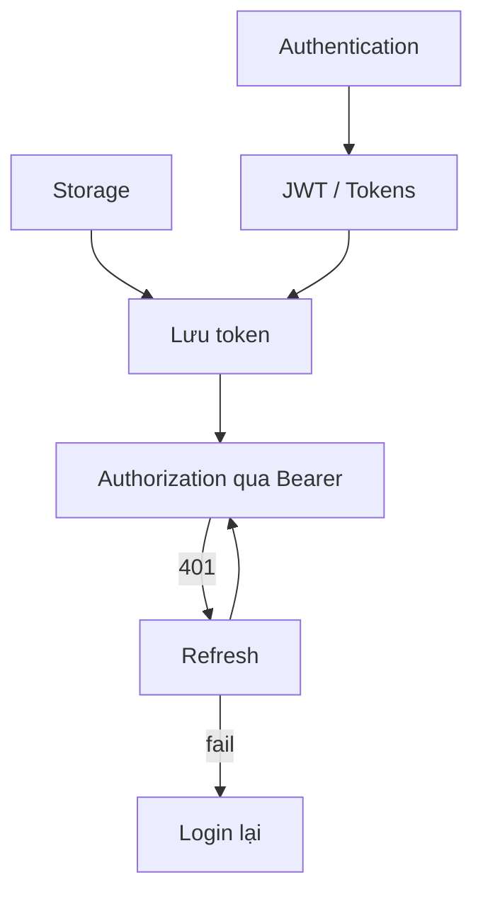

# Giáo án chi tiết — Buổi 29: Browser Storage & Frontend Auth

> Tài liệu tái cấu trúc từ transcript buổi học + danh sách tiêu đề chính.  
> Phần **[Bổ sung]** = AI thêm để dễ hiểu, không có (hoặc chỉ lướt) trong transcript.  
> Phần **[Chưa rõ trong transcript]** = chỗ giảng viên nói ngắt quãng / không chắc.

**Lưu ý phạm vi:** Buổi học đi sâu **Storage** và **Auth**. Modules / Tools / Web Components được nhắc sẽ dạy sau — **không kịp** trong buổi này (giảng viên nói rõ cuối buổi).

---

## I. Tổng quan buổi học

### Tên buổi học

**Buổi 29: Browser storage, Frontend auth**

### Mục tiêu của buổi học

Sau buổi này, người học:

1. Hiểu các cách lưu dữ liệu phía trình duyệt: `localStorage`, `sessionStorage`, Cookies.
2. Biết khi nào dùng từng loại; tránh lưu sai (đặc biệt password).
3. Phân biệt **Authentication** và **Authorization**.
4. Hiểu Session vs JWT; Access Token vs Refresh Token ở mức frontend.
5. Thực hiện được luồng **Register → Login → gọi API có token → Logout → Handle 401** (refresh).

### Đối tượng phù hợp

- Học viên frontend đã biết HTML/CSS/JS cơ bản.
- Đã học **bất đồng bộ** (`fetch`, Promise / async-await) — buổi trước (Buổi 28).
- Chuẩn bị làm dự án có đăng ký / đăng nhập.

### Kiến thức cần có trước buổi học

- DOM: `querySelector`, `addEventListener`, sự kiện `input` / `submit`, `preventDefault`.
- `fetch`, Promise (`.then` / `.catch`) hoặc async/await.
- JSON: `JSON.stringify` / `JSON.parse`.
- Làm việc với form HTML (`name`, `value`).

### Các nội dung chính

| Nhóm | Tiêu đề |
|---|---|
| **Storage** | localStorage (API + draft form + JSON + token) |
| | sessionStorage |
| | Cookies (`document.cookie`, thuộc tính, HttpOnly, Secure, SameSite) |
| **Auth** | Authentication / Authorization |
| | Session vs JWT |
| | Access token / Refresh token |
| | Register / Login / Logout |
| | Handle 401 |

### Kết quả đạt được sau khi học xong

- Tự viết form lưu draft bằng `localStorage` (không lưu password; submit thì xóa đúng key).
- Giải thích được cookie khác Web Storage chỗ nào.
- Vẽ được luồng auth: đăng ký/đăng nhập → lưu token → gọi API có `Authorization` → logout → 401 thì refresh.
- Biết giới hạn: payload JWT đọc được; auth còn rất rộng (SSO, passkey…) — buổi chỉ nền tảng frontend.

---

## II. Nội dung chi tiết

---

### A. Storage — Tổng quan

#### 1. Mục tiêu của phần này

Hiểu “storage trên trình duyệt” là gì, dữ liệu nằm đâu, và có những “ngăn” nào (local / session / cookie / nhắc IndexDB).

#### 2. Khái niệm / kiến thức chính

- **Browser storage**: nơi client lưu dữ liệu mà không cần hỏi server mỗi lần chỉ để “nhớ lại”.
- Giảng viên phân biệt:
  - Lưu trên **ổ cứng (disk)** → tắt trình duyệt vẫn còn (localStorage).
  - Lưu theo **phiên / tab** → đóng tab là mất (sessionStorage).
- Trong DevTools → tab **Application**: xem Local Storage, Session Storage, Cookies.

#### 3. Nội dung giảng viên đã trình bày

- Storage = lưu dữ liệu trên trình duyệt.
- Có nhiều nơi: localStorage, sessionStorage, cookie; nhắc thêm extension storage, IndexDB.
- IndexDB: như một DB NoSQL trên trình duyệt — tổ chức, tìm kiếm dữ liệu có cấu trúc / nhiều; dùng khi bài toán phức tạp hơn “chỉ lưu key-value”.
- Buổi học tập trung **ba thứ**: localStorage, sessionStorage, cookie.

#### 4. Giải thích dễ hiểu

Tưởng tượng trình duyệt có ngăn kéo:

- **localStorage**: ngăn kéo tủ — về nhà vẫn còn đồ.
- **sessionStorage**: khay tạm trên bàn làm việc — đứng dậy (đóng tab) là dọn mất.
- **Cookie**: mảnh giấy dán lên phong bì thư — mỗi lần gửi thư (request) có thể gửi kèm.

#### 5. Ví dụ

- Mở Application trong F12 để chỉ chỗ Local / Session / Cookie.
- [Bổ sung – Ví dụ minh họa] Cùng origin `http://127.0.0.1:5500` thì các tab share localStorage; đổi port là origin khác → storage khác.

#### 6. Case thực tế / tình huống

*(Phần tổng quan chưa có case dài — case nằm ở localStorage form.)*

#### 7. Điểm cần lưu ý

- Không nhầm IndexDB với localStorage: IndexDB là DB, không chỉ “ô nhớ key-value đơn giản”.
- [Bổ sung] Web Storage bị giới hạn theo **origin** (protocol + domain + port).

#### 8. Mối liên hệ với các nội dung khác

Storage là nền để sau đó **lưu token** trong Auth. Cookie vừa là storage vừa gắn với cách session/token gửi lên server.

#### 9. Kiến thức cần ghi nhớ

- Client có nhiều chỗ lưu; buổi này: localStorage, sessionStorage, cookie.
- local ≈ bền; session ≈ theo tab; cookie ≈ có thể tự gửi kèm request.

---

### B. localStorage

#### 1. Mục tiêu của phần này

Thành thạo API localStorage; áp dụng lưu draft form; hiểu chỉ lưu string; biết lưu object bằng JSON; biết dùng để lưu token.

#### 2. Khái niệm / kiến thức chính

**API:**

```javascript
localStorage.setItem(key, value);
localStorage.getItem(key);      // không có → null
localStorage.removeItem(key);
localStorage.clear();           // xóa HẾT trong origin
localStorage.key(index);        // tên key theo chỉ số
localStorage.length;            // số cặp
```

- Có thể gọi qua `window.localStorage`.
- Chỉ lưu **string**. Số cũng thành chuỗi. Object → `JSON.stringify` / `JSON.parse`.
- Tồn tại đến khi xóa bằng code hoặc user xóa dữ liệu site / đổi máy trình duyệt.

#### 3. Nội dung giảng viên đã trình bày

**Use case form login (draft):**

- Form nhiều trường; user F5 hoặc tắt trình duyệt → mất dữ liệu đang gõ.
- Bắt sự kiện `input` trên từng input trong form → `setItem(name, value)`.
- Khi load trang: `getItem(name)` đổ lại `input.value`; nếu `null` thì dùng `|| ""`.
- **Không lưu password** — chỉ lưu các field khác (ví dụ email).
- Khi submit thành công: **không** dùng `clear()` (xóa hết mọi key trên trang); `removeItem` từng key của form.
- Dùng `preventDefault` trên submit để không reload mặc định.

**API bổ sung:**

- Demo `key(index)`: index 0, 1… lấy tên key; ngoài range → `null`.
- `length` = số cặp key-value.

**Chỉ string + JSON:**

- `setItem("abc", 2)` → Application hiện string `"2"`.
- Lưu object user: `JSON.stringify` lúc ghi; `JSON.parse` lúc đọc.

**Bẫy giá trị `""`:**

- Trong Application, value hiện `""` **không phải** string rỗng.
- String rỗng thật: ô trống, `.length === 0`.
- Chuỗi gồm hai ký tự dấu nháy: `.length === 2` — học viên hay nhầm.

**Lưu token:**

- Sau đăng nhập, server trả “chìa khóa” (token) → lưu localStorage → mỗi request gửi kèm để chứng minh là chủ tài khoản.

**Debug khi “không hiện”:**

- Kiểm tra đúng Local Storage; refresh trong Application; bắt đúng sự kiện `input`; debug từng bước (breakpoint hoặc `console.log`).

#### 4. Giải thích dễ hiểu

`localStorage` giống sổ tay dán trên tủ lạnh của website đó: ghi cặp “tên ô → nội dung chữ”. F5 vẫn còn. Muốn ghi object thì phải “chụp ảnh chữ” bằng JSON rồi mới dán sổ.

#### 5. Ví dụ

**Draft form (ý giảng viên):**

```javascript
const formLogin = document.querySelector("#form-login");
const inputs = formLogin.querySelectorAll("input");

inputs.forEach((input) => {
  input.value = localStorage.getItem(input.name) || "";
});

inputs.forEach((input) => {
  input.addEventListener("input", (e) => {
    const { name, value } = e.target;
    if (name === "password") return;
    localStorage.setItem(name, value);
  });
});

formLogin.addEventListener("submit", (e) => {
  e.preventDefault();
  inputs.forEach((input) => localStorage.removeItem(input.name));
});
```

**JSON:**

```javascript
const user1 = { name: "Nguyễn Văn A", age: 20 };
localStorage.setItem("user", JSON.stringify(user1));
const saved = JSON.parse(localStorage.getItem("user"));
```

#### 6. Case thực tế / tình huống

| | |
|---|---|
| **Bối cảnh** | Form đăng nhập / form dài nhiều field |
| **Vấn đề** | User nhập dở, F5 hoặc tắt browser → mất hết |
| **Cách xử lý** | Lưu theo `name` khi `input`; restore khi load; không lưu password; submit xong `removeItem` đúng key |
| **Kết quả** | Mở lại vẫn còn email/draft; password không bị lưu; token/theme khác không bị `clear()` |
| **Bài học** | Persist đúng việc; bảo mật field nhạy cảm; đừng “xóa sạch origin” |

#### 7. Điểm cần lưu ý

- Không lưu mật khẩu vào localStorage.
- `clear()` nguy hiểm khi trang còn token / dữ liệu khác.
- Mọi value là string — so sánh kiểu dễ sai.
- Nhầm `""` (hai ký tự nháy) với empty.
- XSS đọc được localStorage → token trong localStorage không “bí mật tuyệt đối”.

#### 8. Mối liên hệ với các nội dung khác

localStorage dùng lại ở Auth để lưu access/refresh token. So với sessionStorage (mất khi đóng tab) và cookie (tự gửi request).

#### 9. Kiến thức cần ghi nhớ

- `setItem` / `getItem` / `removeItem` / `clear` / `key` / `length`.
- Chỉ string → JSON khi cần object.
- Draft form: lưu khi gõ, đọc khi load, xóa đúng key khi xong.
- Không lưu password; cân nhắc khi lưu token.

---

### C. sessionStorage

#### 1. Mục tiêu của phần này

Biết API giống localStorage nhưng vòng đời theo tab; biết khi nào nên dùng.

#### 2. Khái niệm / kiến thức chính

- Cùng bộ method: `setItem`, `getItem`, `removeItem`, `clear`, `key`, `length`.
- Đóng tab → mất. Mở tab mới → không còn data tab cũ.
- localStorage: đóng tab / tắt browser vẫn còn (trừ khi bị xóa).

#### 3. Nội dung giảng viên đã trình bày

- Demo `sessionStorage.setItem("greeting", "hello")` trong console → Application có; đóng tab mở lại → mất.
- localStorage cùng lúc vẫn còn.
- **Khi nào dùng:** logic muốn “tắt tab = reset” (ví dụ game, kéo-thả / tính toán tạm trên trang).
- Bài toán e-commerce / khóa học thường **ít** gặp nhu cầu này → dùng localStorage nhiều hơn.

#### 4. Giải thích dễ hiểu

sessionStorage = giấy nháp trên bàn một ca làm việc. Tan ca (đóng tab) là bỏ giấy. localStorage = hồ sơ bỏ tủ.

#### 5. Ví dụ

```javascript
sessionStorage.setItem("greeting", "hello");
// Đóng tab → mất
```

> [Bổ sung – Ví dụ minh họa] Wizard nhiều bước chỉ cần nhớ trong tab hiện tại → sessionStorage; “Remember me” / token dài → không dùng sessionStorage nếu muốn mở lại browser vẫn login.

#### 6. Case thực tế / tình huống

| | |
|---|---|
| **Bối cảnh** | Game / logic kéo thả lưu điểm tạm |
| **Vấn đề** | Muốn đóng tab là reset, không giữ “điểm bẩn” lần sau |
| **Cách xử lý** | Ghi state vào sessionStorage |
| **Kết quả** | Tab mới = ván mới |
| **Bài học** | Chọn storage theo **vòng đời mong muốn**, không theo “API quen hơn” |

#### 7. Điểm cần lưu ý

- API giống → dễ nhầm biến `localStorage` / `sessionStorage`.
- Không share giữa các tab (khác localStorage cùng origin).

#### 8. Mối liên hệ với các nội dung khác

Cùng nhóm Web Storage với localStorage; ít dùng cho token dài hạn trong demo Auth của buổi (giảng viên dùng localStorage cho token).

#### 9. Kiến thức cần ghi nhớ

- API giống local; sống theo tab.
- Dùng khi “đóng tab phải mất”.

---

### D. Cookies

#### 1. Mục tiêu của phần này

Hiểu cookie là gì, khác Web Storage chỗ nào, các thuộc tính chính (domain, path, hết hạn, HttpOnly, Secure, SameSite), và vì sao frontend thường không tự set cookie auth “bảo mật thật”.

#### 2. Khái niệm / kiến thức chính

- Cookie: bản ghi name/value (+ metadata) gắn domain.
- **Tự động gửi kèm** request phù hợp lên server (điểm khác local/session storage).
- Dung lượng nhỏ (~4KB theo giảng viên).
- Có thời hạn: session / `Expires` / `Max-Age` (**giây**).
- Frontend: `document.cookie`.
- Cookie “bảo mật hơn” thường do **backend** set, gắn **HttpOnly**.

#### 3. Nội dung giảng viên đã trình bày

- Cookie cũng là nơi lưu; xem trong Application → Cookies.
- Thêm field: domain, path, expires/max-age, size, HttpOnly, Secure, SameSite, (nhắc cross-site / partition…).
- **Domain:** cookie lưu theo domain đang truy cập (vd `127.0.0.1`, `f8.vn`).
- **Path:** phân biệt phạm vi; thường vẫn truy cập khi cùng domain (giảng viên nói không phải lúc nào cũng “đúng path trang mới đọc được”).
- **Hết hạn:** mặc định kiểu session → tắt trình duyệt có thể mất; `Max-Age` tính bằng giây (demo 5 giây → F5 sau 5s mất; nhầm 5000 tưởng ms).
- **Size:** khoảng tổng ký tự name + value (giảng viên tự sửa nhận định trong buổi).
- **HttpOnly:** chỉ set được từ backend response; JS không đọc được cookie đó → giảm rủi ro dán mã độc đọc cookie. Frontend `document.cookie` không set được cờ này.
- **Secure:** chỉ gửi khi HTTPS.
- Cookie **tự đính kèm** request.
- **SameSite / origin:** origin = protocol + domain + port. Cross-site gửi cookie bị trình duyệt hạn chế (liên quan chống theo dõi / “quảng cáo đuổi” ngày trước dùng cross-site cookie; nay chuyển hướng khác như fingerprinting).
- Cookie hay dùng lưu token; bảo mật hơn localStorage **một phần** nhờ HttpOnly — nhưng user mở DevTools copy, hoặc một số extension, vẫn có rủi ro.
- Với bài tập / trang thường: dùng localStorage vẫn chấp nhận được; trang liên quan tiền bạc cần cẩn hơn.
- Thực hành cookie sâu để backend; buổi này chủ yếu giới thiệu.

#### 4. Giải thích dễ hiểu

Cookie = tem dán theo “nhà” (domain). Mỗi lần gõ cửa server, trình duyệt có thể đưa tem theo. Tem HttpOnly = tem trong két — JS trên trang không lấy ra được; chỉ server gửi tem đó về mới khóa két được.

#### 5. Ví dụ

```javascript
document.cookie = "token=abc123; max-age=86400; path=/";
console.log(document.cookie); // chuỗi cần tự parse
```

Demo Max-Age 5 giây trong Application.

#### 6. Case thực tế / tình huống

| | |
|---|---|
| **Bối cảnh** | “Quảng cáo đuổi” / theo dõi cross-site |
| **Vấn đề** | Site A gắn cookie, request sang domain quảng cáo mang theo định danh |
| **Cách xử lý (trình duyệt hiện đại)** | Chặn / hạn chế cross-site cookie (SameSite, chính sách trình duyệt) |
| **Kết quả** | Theo dõi cũ khó hơn; bên quảng cáo chuyển cách khác (vd fingerprinting — giảng viên nhắc) |
| **Bài học** | Cookie không chỉ “lưu token app”; còn gắn privacy |

#### 7. Điểm cần lưu ý

- Max-Age = **giây**, không phải mili giây.
- HttpOnly không set từ JS thuần.
- `document.cookie` trả về một string gộp nhiều cookie.
- Cookie “an toàn hơn” ≠ tuyệt đối an toàn.
- [Chưa rõ trong transcript] Một số thuộc tính (partition, priority) giảng viên chỉ liếc DevTools, không giải thích đủ.

#### 8. Mối liên hệ với các nội dung khác

Đối trọng với localStorage khi nói lưu token. Liên quan Auth (session cookie vs Bearer token). Secure liên quan HTTPS.

#### 9. Kiến thức cần ghi nhớ

- Cookie tự gửi kèm request; Web Storage thì không.
- HttpOnly / Secure / SameSite / Max-Age.
- Auth cookie “đúng bài” thường do backend set.

---

### E. Authentication & Authorization

#### 1. Mục tiêu của phần này

Phân biệt rõ hai khái niệm; biết bước login khác bước gọi API có token.

#### 2. Khái niệm / kiến thức chính

| | Authentication | Authorization |
|---|---|---|
| Câu hỏi | Bạn là **ai**? | Bạn **được phép** làm gì / xem gì? |
| Ví dụ buổi học | Gửi tài khoản + mật khẩu khi đăng nhập | Gửi **token** khi lấy danh sách bài tập / thông tin user |

#### 3. Nội dung giảng viên đã trình bày

- Auth chia hai phần: authentication (xác minh danh tính) và authorization (kiểm tra quyền truy cập tài nguyên).
- Đăng nhập xong vào trang chủ; mỗi request lấy tài nguyên gửi kèm token → authorization.
- Tài khoản/mật khẩu chứng minh “bạn là ai”; token chứng minh “bạn có quyền với request này”.
- Luôn cần cả hai bước theo trình tự: đăng nhập trước, rồi mới mang token đi xin tài nguyên.

#### 4. Giải thích dễ hiểu

- Authentication = bảo vệ cổng: đưa CMND (password).
- Authorization = trong tòa nhà: thẻ nhân viên (token) mới vào được phòng server / hồ sơ.

#### 5. Ví dụ

- Bấm login gửi username/password → authentication.
- Bấm xem bài tập / gọi `/users/me` kèm token → authorization.

#### 6. Case thực tế / tình huống

*(Gắn với demo Spotify API ở phần sau.)*

#### 7. Điểm cần lưu ý

- Hay gọi nhầm cả hai là “auth”.
- Có token chưa chắc đủ quyền (role) — authorization còn kiểm role/permission. [Bổ sung] buổi tập trung token hợp lệ hơn là RBAC chi tiết.

#### 8. Mối liên hệ với các nội dung khác

Authentication tạo ra token (JWT/session). Authorization dùng token đó. Token hay nằm ở localStorage hoặc cookie.

#### 9. Kiến thức cần ghi nhớ

- AuthN = là ai (credentials).
- AuthZ = được làm gì (thường qua token).

---

### F. Session vs JWT

#### 1. Mục tiêu của phần này

Hiểu hai hướng thiết kế phiên đăng nhập; vì sao JWT phổ biến hơn với nhiều API hiện đại.

#### 2. Khái niệm / kiến thức chính

**Session (cách cũ hơn — stateful):**

1. Login OK → server tạo mã phiên (vd `ABC123`), **lưu trên server**.
2. Gửi mã về client.
3. Request sau kèm mã → server **đối chiếu DB/store** → nhận ra user.

**JWT (JSON Web Token — server không cần lưu “mã phiên” giống session cổ điển):**

1. Login OK → server tạo JWT đưa client.
2. Client gửi JWT mỗi request.
3. Server **kiểm tra JWT có hợp lệ không** (chữ ký, hạn…) — giảm bước lấy session trong DB mỗi lần (theo giảng viên).

Token nói chung = đoạn mã. Session id thường là chuỗi ngẫu nhiên **không dịch ra thông tin**. JWT là token **mang thông tin** (decode được header/payload).

#### 3. Nội dung giảng viên đã trình bày

- Hai cách: session và JWT; session ngày càng ít dùng hơn trong các hệ thống giảng viên hướng tới.
- So sánh lưu / không lưu mã trên server như trên.
- JWT gồm 3 phần ngăn dấu chấm: **header**, **payload**, **signature** (giảng viên từng nói “verification” rồi thống nhất signature).
- Header: thuật toán (vd HS256), type JWT — encode Base64 (demo `btoa`/`atob`, nhắc URL-safe).
- Payload: thông tin user (`sub`/id, name, role, `iat` thời gian tạo; thường thêm thời hạn `exp` — giảng viên lúc đầu phân vân `iat` vs expire rồi làm rõ `iat` = issued at, nên có thêm expire).
- Signature: kết hợp header + payload + **secret chỉ ở server** bằng thuật toán (HS256); mã hóa một chiều → không suy ngược secret; kẻ mạo danh thiếu secret không tạo đúng chữ ký.
- Demo encode/decode header & payload bằng Base64 → **payload không phải bí mật**.
- JWT đã phát hành khó “hủy sớm” vì hạn nằm trong token; session sửa trên server là hết hạn ngay.
- Kỹ thuật **blacklist**: ghi JWT (còn hạn) vào danh sách cấm + thời hạn; request tới thì check blacklist trước.

#### 4. Giải thích dễ hiểu

- Session: nhà trường giữ sổ “mã số học sinh ↔ hồ sơ”; bạn đưa mã, nhà trường mở sổ.
- JWT: thẻ có in sẵn thông tin + dấu mộc nhà trường; bảo vệ nhìn thẻ và dấu mộc, không cần mở sổ mỗi lần (trừ khi có sổ đen blacklist).

#### 5. Ví dụ

Cấu trúc:

```text
eyJhbGciOiJIUzI1NiIsInR5cCI6IkpXVCJ9.eyJzdWIiOiIxMjM0In0.signature...
```

Demo lớp: `btoa` object header (bỏ khoảng trắng) gần giống phần đầu JWT.

#### 6. Case thực tế / tình huống

| | |
|---|---|
| **Bối cảnh** | Muốn logout / khóa tài khoản ngay trong khi JWT còn 1 giờ |
| **Vấn đề** | Server không lưu session → không “xóa phiên” như session cổ |
| **Cách xử lý** | Blacklist token đến khi `exp` |
| **Kết quả** | Token còn hạn nhưng bị từ chối |
| **Bài học** | Stateless tiện scale nhưng thu hồi cần cơ chế thêm |

#### 7. Điểm cần lưu ý

- Payload JWT **đọc được** — không nhét mật khẩu / dữ liệu cực nhạy.
- Secret không đưa ra frontend.
- [Chưa rõ trong transcript] Chi tiết toán học HMAC/SHA256 giảng viên nói đã quên phần sâu — chỉ cần hiểu mô hình secret + one-way.
- Mâu thuẫn nhẹ trong buổi: lúc nói JWT server “không lưu”, lúc nói blacklist thì **có lưu** danh sách cấm — không đối lập nếu hiểu: không lưu session đầy đủ, nhưng có thể lưu exception list.

#### 8. Mối liên hệ với các nội dung khác

JWT cụ thể hóa thành Access/Refresh. Cách gửi JWT gắn Authorization header và/hoặc cookie.

#### 9. Kiến thức cần ghi nhớ

- Session: mã opaque + store server.
- JWT: 3 phần; payload đọc được; signature cần secret server.
- Thu hồi sớm JWT → blacklist (hoặc chờ hết hạn).

---

### G. Access Token & Refresh Token

#### 1. Mục tiêu của phần này

Hiểu cặp token; vì sao access ngắn / refresh dài; rotation là lựa chọn thiết kế.

#### 2. Khái niệm / kiến thức chính

| | Access Token | Refresh Token |
|---|---|---|
| Dùng để | Gọi API tài nguyên (`Authorization: Bearer …`) | Xin access mới khi access hết hạn |
| Thời hạn (theo GV) | Ngắn: vài chục giây → vài phút → vài giờ | Dài: 1 ngày → 7 ngày → 1 tháng |
| Tần suất gửi | Gần như mọi request bảo vệ | Ít — lúc refresh |

Lý do thiết kế (giảng viên): access gửi rất nhiều → dễ bị bắt hơn → hạn ngắn để giảm thiệt hại; refresh ít lộ trên đường truyền hơn.

#### 3. Nội dung giảng viên đã trình bày

- Register/login thành công (API Spotify demo) trả `accessToken` + `refreshToken` (có thể kèm message, user…).
- Học viên hỏi: access ngắn + refresh liên tục để tăng bảo mật → GV đồng ý hướng đó.
- Refresh xong: có thể cấp access mới **và** refresh mới, hoặc chỉ access mới — **tùy backend** (logic, không phải định luật).
- Chỉ dùng một access hạn dài (vd 7 ngày) cũng “được” về mặt logic.
- App ngân hàng: đôi khi chỉ access rất ngắn (vài chục giây / vài phút), không refresh — hết hạn là out, bắt login lại.
- Refresh **không** đồng nghĩa “bảo mật 2 lớp” (2FA) — chỉ bảo mật hơn một nấc trong thiết kế token.

#### 4. Giải thích dễ hiểu

Access = thẻ vào cửa phòng họp ngày hôm nay (hết ngày là đứt). Refresh = giấy ủy quyền hiếm khi đưa ra, chỉ để xin thẻ mới ở quầy lễ tân — không dùng giấy đó để đi vào mọi phòng.

#### 5. Ví dụ

```http
Authorization: Bearer <access_token>
```

Lưu:

```javascript
localStorage.setItem("accessToken", data.accessToken);
localStorage.setItem("refreshToken", data.refreshToken);
```

#### 6. Case thực tế / tình huống

| | |
|---|---|
| **Bối cảnh** | Tin tặc bắt được gói tin có access token |
| **Vấn đề** | Nếu access sống cả tuần → cửa sổ lạm dụng dài |
| **Cách xử lý** | Access vài phút; bắt buộc refresh định kỳ |
| **Kết quả** | Token đánh cắp sớm hết hạn |
| **Bài học** | Thời hạn = tham số bảo mật theo độ nhạy cảm hệ thống |

#### 7. Điểm cần lưu ý

- Không lấy refresh gắn vào mọi API thường.
- Contract API khác nhau (body vs header khi refresh) — phải đọc response thật, đừng tin AI/Postman mù.

#### 8. Mối liên hệ với các nội dung khác

Dùng trong Register/Login (nhận token), gọi API (access), Handle 401 (refresh). Lưu bằng localStorage trong demo.

#### 9. Kiến thức cần ghi nhớ

- Access ngắn + hay dùng; refresh dài + ít dùng.
- Thiết kế token là **logic sản phẩm**, có nhiều biến thể hợp lệ.

---

### H. Register / Login / Logout

#### 1. Mục tiêu của phần này

Thực hiện được 3 luồng trên frontend với `fetch`, FormData, lưu/xóa token, chuyển trang, auth guard cơ bản.

#### 2. Khái niệm / kiến thức chính

- **Register:** gửi thông tin tạo tài khoản → nhận token (hoặc bảo login lại — demo nhận token luôn).
- **Login:** gửi email/password → nhận token.
- **Logout:** xóa token client (+ gọi API revoke nếu có).
- **FormData** + `Object.fromEntries(...)` gom field theo `name`.
- `Content-Type: application/json` + `JSON.stringify` khi gửi JSON.
- Lỗi HTTP 4xx từ API thường **vẫn vào `.then`**, không phải `.catch` (`.catch` ≈ mạng/CORS/…); cần đọc `data.error` / status.
- **Guard:** đã login thì không vào login/register; chưa login thì không vào trang cần auth.

#### 3. Nội dung giảng viên đã trình bày

**Register (demo Spotify API):**

- Form: username, email, password, displayName, bio, country…
- `preventDefault`; FormData → object; POST register; headers JSON; body stringify.
- Thành công → access + refresh → `localStorage` → redirect trang chủ.
- Email/username trùng → body lỗi; `fetch` vẫn “thành công” ở tầng mạng → xử lý trong `then` (vd `data.error?.message`).
- Nhắc các loại Content-Type (JSON text vs form-urlencoded vs multipart khi có file).

**Trang chủ sau login:**

- GET `/api/users/me` (hoặc tương đương) kèm `Authorization: Bearer` + access từ localStorage.
- Hiển thị username, email.
- Cảnh báo: **không copy/chụp token** cho người khác.

**Logout:**

- API logout có thể không có trên collection demo → tối thiểu: `removeItem` access + refresh → về login.
- Nếu có API logout: gọi báo server + xóa local.

**Login page:**

- Tương tự register: FormData, POST login, lưu token, về index.

**Guard / chống vào nhầm trang:**

- Đang login mà vào login/register → gọi `/me` (hoặc check token) → đá về index.
- Chưa login vào index → đá về login.
- Hiện tượng **nháy (flash)** vì phải đợi request; có thể tối ưu bằng check token local trước — GV để bài tập / làm thật sau.
- Code guard copy nhiều nơi chưa tối ưu — làm đúng luồng trước.

#### 4. Giải thích dễ hiểu

Đăng ký/đăng nhập = nhận hai chìa (access + refresh) bỏ túi (localStorage). Vào nhà (= trang chủ) phải đưa chìa access. Ra về (logout) = vứt chìa trong túi. Không có chìa mà xô cửa trang chủ → bị đưa lại cổng login.

#### 5. Ví dụ

```javascript
// Ý tưởng register/login
const data = Object.fromEntries(new FormData(form).entries());
fetch(url, {
  method: "POST",
  headers: { "Content-Type": "application/json" },
  body: JSON.stringify(data),
})
  .then((res) => res.json())
  .then((data) => {
    if (data.error) return console.log(data.error.message);
    localStorage.setItem("accessToken", data.accessToken);
    localStorage.setItem("refreshToken", data.refreshToken);
    location.href = "./index.html";
  });

// Gọi /me
fetch(apiUserMe, {
  headers: {
    Authorization: `Bearer ${localStorage.getItem("accessToken")}`,
  },
}).then(/* hiện user */);

// Logout
localStorage.removeItem("accessToken");
localStorage.removeItem("refreshToken");
location.href = "./login.html";
```

#### 6. Case thực tế / tình huống

| | |
|---|---|
| **Bối cảnh** | Demo register Spotify F8 team API trên lớp |
| **Vấn đề** | Trùng email/username; hiểu nhầm lỗi luôn vào `.catch` |
| **Cách xử lý** | Đọc body lỗi trong `then`; đổi username/email; lưu token khi thành công |
| **Kết quả** | Có token trong Application; trang chủ gọi `/me` hiện user |
| **Bài học** | Phân biệt lỗi mạng vs lỗi nghiệp vụ; luôn verify Network + Application |

#### 7. Điểm cần lưu ý

- Input thiếu `name` → FormData thiếu field.
- Password policy phía API (hoa/thường/số/ký tự đặc biệt) — GV nhắc khi demo.
- Không share token.
- Guard chưa xử lý hết UX nháy trang.

#### 8. Mối liên hệ với các nội dung khác

Dựa localStorage; dùng JWT/access/refresh; chuẩn bị cho Handle 401.

#### 9. Kiến thức cần ghi nhớ

- Register/Login → lưu 2 token → gọi API có Bearer.
- Logout → xóa token (+ API nếu có).
- Guard hai chiều: private vs public pages.

---

### I. Handle 401

#### 1. Mục tiêu của phần này

Khi access hết hạn/sai, dùng refresh lấy access mới rồi thử lại — thay vì logout ngay nếu refresh còn hạn.

#### 2. Khái niệm / kiến thức chính

- **401 Unauthorized** (trong ngữ cảnh buổi): access không còn hợp lệ.
- Flow: phát hiện 401 → gọi endpoint refresh với refresh token → lưu access mới → gọi lại request (hoặc reload).
- Refresh fail → xóa token → về login.

#### 3. Nội dung giảng viên đã trình bày

- Auth rất rộng; handle 401 là một kỹ thuật trong nhiều kỹ thuật (SSO, passkey, sinh trắc, fingerprinting… chỉ nêu tên).
- Demo: sửa access token trong Application cho sai → `/me` ra 401.
- Bắt `res.status === 401` → POST refresh (đúng path API) → log data thật.
- API demo có lúc **chỉ trả access mới**, không trả refresh mới — làm theo backend, không cứng nhắc “luôn rotation”.
- Sau khi set access mới → reload / gọi lại → user vẫn ở trang chủ.
- Nhắc đừng tin AI bịa body/header refresh — phải thử và đọc response.

#### 4. Giải thích dễ hiểu

Thẻ vào cửa hết hạn (401). Đưa giấy ủy quyền (refresh) xin thẻ mới. Xin được → vào lại. Giấy ủy quyền cũng hết → phải đăng nhập lại từ đầu.

#### 5. Ví dụ

Luồng lớp (rút gọn):

```javascript
const res = await fetch(userMeUrl, {
  headers: { Authorization: `Bearer ${localStorage.getItem("accessToken")}` },
});

if (res.status === 401) {
  const refreshRes = await fetch(refreshUrl, {
    method: "POST",
    headers: {
      Authorization: `Bearer ${localStorage.getItem("refreshToken")}`,
    },
  });
  const data = await refreshRes.json();
  localStorage.setItem("accessToken", data.accessToken);
  location.reload(); // demo nhanh; production thường retry request
}
```

> [Bổ sung – Ví dụ minh họa] Nên bọc `apiFetch` dùng chung cho mọi API thay vì copy khối 401 khắp nơi.

#### 6. Case thực tế / tình huống

| | |
|---|---|
| **Bối cảnh** | Access bị sửa / hết hạn khi đang ở trang chủ |
| **Vấn đề** | Mất quyền gọi `/me` → dễ bị đá login dù refresh còn sống |
| **Cách xử lý** | 401 → refresh → set access → reload/retry |
| **Kết quả** | Access mới hiện trong Application; trang chủ lại có user |
| **Bài học** | 401 ≠ luôn logout; hãy thử refresh trước |

#### 7. Điểm cần lưu ý

- Phân biệt 401 (auth) với 403 (có nhận diện nhưng không đủ quyền) — [Bổ sung] buổi tập trung 401.
- Tránh vòng lặp refresh vô hạn nếu refresh luôn 401.
- Contract API refresh khác nhau giữa dự án.

#### 8. Mối liên hệ với các nội dung khác

Hoàn thiện vòng đời Access/Refresh; phụ thuộc đã Login và đã lưu token.

#### 9. Kiến thức cần ghi nhớ

- 401 → refresh → lưu access → retry.
- Refresh fail → logout về login.

---

## III. Luồng tư duy của toàn bộ buổi học

```text
Vấn đề: dữ liệu trên form / phiên user mất khi F5, tắt tab, hoặc cần “nhớ đăng nhập”
    ↓
Storage: localStorage (bền) vs sessionStorage (theo tab) vs Cookie (tự gửi server)
    ↓
localStorage thực hành draft form + hiểu string/JSON + cảnh báo password
    ↓
Cookie: hướng lưu token “bảo mật hơn” (HttpOnly từ backend) — giới thiệu
    ↓
Cần đăng nhập thật → AuthN (là ai) vs AuthZ (được làm gì)
    ↓
Cách giữ phiên: Session (server nhớ) vs JWT (token tự chứa claims + chữ ký)
    ↓
Thực tế API: Access (ngắn) + Refresh (dài)
    ↓
Register / Login lưu token → gọi API Bearer → Logout xóa token + Guard trang
    ↓
Access chết giữa chừng → Handle 401 bằng Refresh
    ↓
(Modules / Tools → buổi sau — không kịp)
```

**Vì sao thứ tự này?**

1. Không hiểu storage thì không biết token đang nằm đâu.
2. Không phân AuthN/AuthZ thì nhầm “đã login” với “được gọi API”.
3. Không hiểu JWT/access/refresh thì không hiểu vì sao có 401 và phải refresh.
4. Handle 401 chỉ có nghĩa sau khi đã có cặp token và luồng gọi API.



---

## IV. Key Takeaways

1. **localStorage bền theo origin, chỉ string** — F5 không mất; object cần JSON.  
   *Quan trọng:* nền tảng draft form và lưu token trong bài học.

2. **Không lưu password vào storage** — dễ lộ trên máy dùng chung / XSS.  
   *Quan trọng:* thói quen bảo mật tối thiểu.

3. **`clear()` xóa cả origin** — submit form chỉ nên `removeItem` đúng key.  
   *Quan trọng:* tránh xóa nhầm token/theme.

4. **sessionStorage mất khi đóng tab** — chọn theo vòng đời mong muốn.  
   *Quan trọng:* tránh nhầm với localStorage vì API giống.

5. **Cookie tự gửi kèm request; Web Storage thì không** — khác biệt kiến trúc.  
   *Quan trọng:* hiểu session cookie vs gắn Bearer thủ công.

6. **HttpOnly chỉ backend set được** — JS không đọc cookie đó.  
   *Quan trọng:* hướng lưu token an toàn hơn localStorage (vẫn không tuyệt đối).

7. **AuthN ≠ AuthZ** — password vs token/quyền.  
   *Quan trọng:* nền tảng mọi hệ thống login.

8. **JWT = header.payload.signature; payload đọc được** — bảo mật ở chữ ký + secret server.  
   *Quan trọng:* không nhét secret vào payload; không đưa secret ra client.

9. **Access ngắn, Refresh dài** — giảm thiệt hại khi access bị bắt.  
   *Quan trọng:* giải thích được thiết kế phổ biến (và biến thể ngân hàng).

10. **`fetch` 4xx thường không vào `.catch`** — phải đọc body/status.  
    *Quan trọng:* debug register/login đúng chỗ.

11. **Logout = xóa token client (+ revoke nếu có)** — redirect không đủ.  
    *Quan trọng:* “đăng xuất giả”.

12. **401 → refresh → retry; refresh fail → login** — Handle 401.  
    *Quan trọng:* UX phiên đăng nhập với access ngắn hạn.

13. **Auth là logic rộng** — SSO, passkey, biometrics… ngoài một buổi.  
    *Quan trọng:* biết biên giới kiến thức đã học.

---

## V. Những nội dung cần đào sâu thêm

| Nội dung | Vì sao | Nên tìm hiểu thêm |
|---|---|---|
| Cookie attributes (SameSite Strict/Lax/None, Partitioned) | GV giới thiệu nhanh, DevTools nhiều cột | MDN `Set-Cookie`, CSRF vs SameSite |
| IndexDB | Chỉ nêu tên | Khi nào cần DB client, so với localStorage |
| Chi tiết mật mã JWT (HMAC, Base64URL) | GV demo `btoa`, nói đã quên phần sâu | jwt.io, RFC 7519 ở mức đọc hiểu |
| Blacklist / revoke / rotation | Nêu ý tưởng | Redis blacklist, refresh rotation theft detection |
| XSS vs CSRF với từng chỗ lưu token | Có nhắc XSS/HttpOnly/extension | OWASP cheat sheet |
| Auth guard & chống flash UI | GV để bài tập | Check token sync + skeleton; central `auth-guard` |
| Wrapper `apiFetch` + queue khi nhiều 401 cùng lúc | Demo reload đơn giản | Retry queue, tránh refresh song song |
| Modules tách `http` / `auth` | Buổi không kịp | Buổi 30 ESM |
| SSO / OAuth / Passkey | Chỉ liệt kê cuối buổi | OAuth2 Authorization Code + PKCE (sau này) |

---

## VI. Câu hỏi ôn tập

### Level 1 – Nhớ kiến thức

1. Liệt kê 6 thành viên API chính của `localStorage`.
2. `getItem` khi không có key trả về gì?
3. sessionStorage mất khi nào?
4. Điểm khác cốt lõi giữa cookie và localStorage khi gọi API?
5. Authentication khác Authorization ở câu hỏi then chốt nào?
6. JWT gồm mấy phần, ngăn bằng ký tự gì?
7. Access token thường dùng để làm gì? Refresh để làm gì?
8. Header gắn access token thường viết thế nào?
9. Logout phía client tối thiểu phải làm gì với storage?
10. Status HTTP nào buổi học dùng để kích hoạt refresh?

### Level 2 – Hiểu

1. Vì sao không dùng `localStorage.clear()` sau khi submit form draft?
2. Vì sao mọi giá trị trong Web Storage đều nên được coi là string?
3. Vì sao giảng viên không cho lưu password vào localStorage?
4. Vì sao payload JWT “không bí mật” nhưng JWT vẫn dùng được để xác thực?
5. Vì sao access thường ngắn hạn còn refresh dài hạn?
6. Vì sao lỗi “email đã tồn tại” có thể không rơi vào `.catch` của `fetch`?
7. Session cổ điển thu hồi phiên dễ hơn JWT chỗ nào?
8. HttpOnly giúp gì? Frontend tự set được không?
9. Vì sao vào trang login khi đã có token hợp lệ lại nên redirect về home?
10. Max-Age cookie đơn vị là gì? Nhầm đơn vị gây hậu quả gì?

### Level 3 – Vận dụng

1. Form 12 field (có password + confirm password). Thiết kế lưu draft + restore + cleanup sau đăng ký thành công.
2. User mở 2 tab cùng site. Tab A logout. Tab B vẫn hiện “đã login” và gọi API — phân tích và đề xuất hướng xử lý. [Bổ sung gợi ý sự kiện `storage`]
3. Viết pseudo-code `apiFetch` handle 401 một lần; refresh fail thì về login; tránh vòng lặp vô hạn.
4. Product owner muốn “chỉ 1 token, hạn 30 ngày, không refresh”. Phân tích trade-off so với access+refresh.
5. Nghi ngờ XSS trên site đang lưu access+refresh ở localStorage. Liệt kê rủi ro và 3 hướng giảm thiểu (kể cả chuyển cookie HttpOnly).
6. API refresh chỉ trả access mới (không rotation refresh). Cập nhật client sau 401 thế nào? Có cần xóa refresh không?
7. Trang `/me` bị nháy login trước khi vào home khi đã đăng nhập. Đề xuất 2 cách giảm flash dựa trên những gì GV gợi ý.
8. Cần “đăng xuất mọi thiết bị”. Chỉ xóa localStorage máy hiện tại có đủ không? Cần thêm gì phía server (liên hệ blacklist/session)?
9. Phân biệt xử lý khi `/me` trả 401 vì access hết hạn với trường hợp user gõ sai password lúc login (cũng có thể 401).
10. Thiết kế checklist review PR cho feature login của teammate (storage, guard, 401, không log token…).

### Đáp án / hướng dẫn trả lời

**Level 1 (tóm tắt):**  
1) set/get/remove/clear/key/length. 2) `null`. 3) Đóng tab. 4) Cookie có thể tự gửi; LS không. 5) Là ai vs được làm gì. 6) 3 phần, dấu `.`. 7) Gọi API / xin access mới. 8) `Authorization: Bearer …`. 9) Xóa access (+ refresh). 10) 401.

**Level 2:**  
1) Tránh xóa token/key khác. 2) Spec Web Storage + ép kiểu. 3) Lộ secret trên client. 4) Bảo mật ở signature+secret, không ở che payload. 5) Access hay bị bắt hơn → cửa sổ ngắn; refresh ít gửi. 6) HTTP về được → `then`; check body/status. 7) Sửa/xóa store server. 8) Chống JS đọc cookie; chỉ backend set. 9) Tránh login lại / UX sai. 10) Giây; 5000 giây ≈ >1 giờ thay vì 5 giây.

**Level 3 (hướng xử lý):**  
1) Lưu mọi field trừ password/confirm; restore on load; sau success remove đúng key.  
2) Logout tab A xóa LS → tab B nên lắng nghe `storage` hoặc lần gọi API 401 rồi sync logout.  
3) Flag `isRefreshing`; 401 → refresh một lần → retry; fail → clear → login; đừng refresh khi chính refresh trả 401.  
4) Đơn giản nhưng lộ token = cửa sổ 30 ngày; ngân hàng thường ngược lại.  
5) XSS đọc token; CSP/sanitize; HttpOnly cookie; access ngắn; không log.  
6) Chỉ `setItem` access; giữ refresh cũ.  
7) Check token local trước khi fetch; ẩn UI/skeleton đến khi xong guard.  
8) Không đủ — cần revoke phía server (blacklist refresh / version user).  
9) Login sai: không có phiên; 401 `/me`: có refresh thì thử gia hạn.  
10) Checklist: không lưu password; lưu token đúng; Bearer; guard; 401 refresh; không commit/log token; HTTPS production.

---

## VII. Cheat Sheet

### Storage

| | localStorage | sessionStorage | Cookie |
|---|---|---|---|
| Sống | Lâu (đến khi xóa) | Theo tab | Theo Max-Age/Expires/session |
| Share tab | Có (cùng origin) | Không | Có (theo rule cookie) |
| Tự gửi request | Không | Không | Có |
| API | `setItem/getItem/...` | Giống | `document.cookie` / `Set-Cookie` |

**Rule:** chỉ string → JSON cho object. **Cấm** lưu password. Submit draft → `removeItem`, đừng `clear()` bừa.

**Bẫy:** value hiện `""` có thể là 2 ký tự nháy (length 2), không phải empty.

### Auth một dòng

```text
Register/Login → access + refresh → localStorage
→ API: Authorization: Bearer <access>
→ Logout: xóa token
→ 401: refresh → access mới → retry | fail → login
```

### JWT

`header.payload.signature` · payload Base64 **đọc được** · secret **chỉ server** · thu hồi sớm ≈ blacklist.

### AuthN vs AuthZ

Credentials = bạn là ai · Token trên request = bạn được làm gì (trong phạm vi buổi học).

### Access vs Refresh

Ngắn + hay gửi · Dài + ít gửi · Rotation tùy backend.

### fetch lỗi nghiệp vụ

4xx vẫn có response → đọc `status` / `data.error`, đừng chỉ `.catch`.

### Cookie nhanh

HttpOnly (JS không đọc, backend set) · Secure (HTTPS) · SameSite · Max-Age = **giây**.

### Lỗi thường gặp

- F5 mất draft → quên `getItem` lúc load.  
- Logout giả → chỉ đổi trang, quên `removeItem`.  
- 401 là logout ngay → quên refresh.  
- Tin `.catch` bắt “email trùng”.  
- Copy token cho người khác.

### Buổi này không kịp

Modules, npm, Vite, Web Components → học Buổi 30+.

---

*Hết giáo án Buổi 29.*
