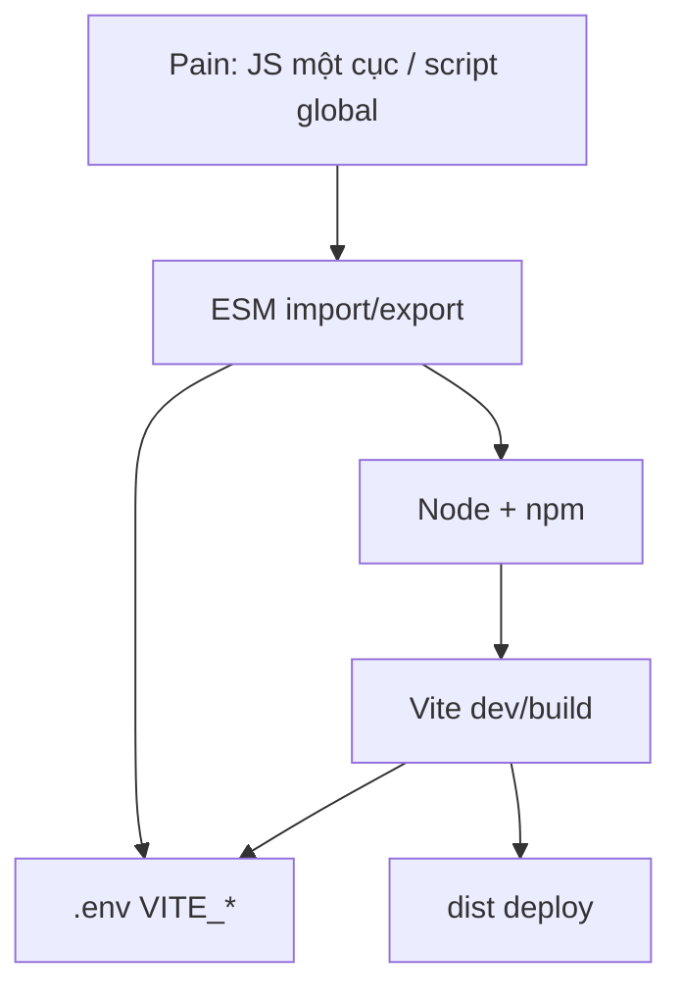

# Giáo án chi tiết — Buổi 30: JS Modules, Vite, npm

> Tài liệu tái cấu trúc từ transcript buổi học + danh sách tiêu đề chính.  
> **[Bổ sung]** = AI thêm để dễ hiểu, không có (hoặc chỉ lướt) trong transcript.  
> **[Chưa rõ trong transcript]** = chỗ giảng viên nói ngắt / chưa chắc.

**Phạm vi buổi:** ES Modules (`import`/`export`, `type="module"`, dynamic import, top-level await, CommonJS, `export from`) và Tools (Node.js, npm, `package.json`, Vite, `.env`). Phần thực hành Spotify + Tailwind là **áp dụng tool**, không phải lý thuyết module cốt lõi.

---

## I. Tổng quan buổi học

### Tên buổi học

**Day 30: Modules, Tools** — JS Modules, Vite, npm

### Mục tiêu của buổi học

1. Hiểu vì sao cần chia file JS thành **module** (scope riêng, không “thông” global).
2. Thành thạo **named / default** export–import; biết ưu tiên named.
3. Biết đặc điểm `type="module"`, top-level await, dynamic import, CommonJS vs ESM, kỹ thuật `export … from`.
4. Cài và dùng **Node.js + npm**; đọc `package.json` (scripts, dependencies / devDependencies).
5. Tạo dự án **Vite** (vanilla), chạy `dev` / `build` / `preview`; hiểu HMR và thư mục `dist/`.
6. Dùng biến môi trường Vite: `VITE_*` + `import.meta.env` (không dùng `process.env` trên browser).

### Đối tượng phù hợp

- Học viên đã xong HTML/CSS/JS, bất đồng bộ (`fetch`), Storage & Auth (Buổi 29).
- Sắp làm dự án cuối module JS / chuẩn bị React + Vite các buổi sau.

### Kiến thức cần có trước buổi học

- Tách nhiều file JS bằng nhiều thẻ `<script>` (cách cũ).
- `fetch`, async/await.
- Terminal cơ bản (`cd`, chạy lệnh).
- Khái niệm gọi API / BASE_URL (đã dùng ở auth/Spotify).

### Các nội dung chính

| Nhóm | Tiêu đề |
|---|---|
| **Modules** | Giới thiệu ESM; named / default import–export; kết hợp; `type="module"`; thiết kế module; dynamic import; top-level await; CommonJS; `export from` |
| **Tools** | Node.js; npm; `package.json`; Vite (tạo project, lệnh, vì sao dùng); `.env` / `import.meta.env` |

### Kết quả đạt được sau khi học xong

- Tách `httpRequest` (hoặc tương đương) thành module, import vào file chính với `type="module"`.
- Giải thích được named vs default; vì sao ưu tiên named.
- Tạo app Vite vanilla, `npm install`, `npm run dev`, build ra `dist/`.
- Phân biệt `npm run dev` với gõ `vite` trực tiếp; `dependencies` vs `devDependencies`.
- Đưa BASE_URL vào `.env` với prefix `VITE_`, đọc bằng `import.meta.env`.

---

## II. Nội dung chi tiết

---

### A. ES Modules — Giới thiệu & vấn đề cần giải quyết

#### 1. Mục tiêu của phần này

Hiểu module giải quyết vấn đề gì so với nhiều thẻ `<script>` thủ công; hình dung “hộp khóa + export/import”.

#### 2. Khái niệm / kiến thức chính

- **ES Modules (ESM):** cách chính thức chia nhỏ, tái sử dụng JS.
- Mỗi file có `import`/`export` = **một module**, **scope riêng** — không lộ biến ra global như script thường.
- Trên trình duyệt: `<script type="module" src="...">`.
- **Build tool** (Vite): tạo khung project sẵn (HTML/JS/CSS/folder) thay vì làm thủ công — học sau phần module.

#### 3. Nội dung giảng viên đã trình bày

- Trước đây: `index.html` + `script.js` thủ công; dự án lớn → cần chia nhiều file JS.
- Không module: nhiều `<script src>` — file sau **đọc được** biến file trước (cùng global).
- Có `export` → file thành module → bên ngoài **chỉ** lấy được thứ đã export, qua `import`.
- Ví von: module như hộp; chỉ lỗ `export` mới lấy đồ được.
- File chính thường chỉ import để làm việc, không cần export.
- Khi đã `import` từ file chính (`type="module"`), **không cần** thêm thẻ `<script src="httpRequest.js">`.

#### 4. Giải thích dễ hiểu

Script cũ = mọi người đổ đồ chung một phòng khách → dễ trùng tên. Module = mỗi người một tủ có khóa; muốn mượn phải ghi rõ “cho mượn cái gì” (`export`) và “tôi mượn cái gì” (`import`).

#### 5. Ví dụ

```html
<!-- Cách cũ: hai script thông nhau -->
<script src="./httpRequest.js"></script>
<script src="./script.js"></script>

<!-- Cách module -->
<script type="module" src="./script.js"></script>
```

#### 6. Case thực tế / tình huống

| | |
|---|---|
| **Bối cảnh** | Nhiều lần `fetch` trùng BASE_URL, try/catch, method |
| **Vấn đề** | Copy-paste dài; đổi domain phải sửa nhiều chỗ |
| **Cách xử lý** | Tách `httpRequest.js` export object `get`/`post` |
| **Kết quả** | File chính chỉ còn `httpRequest.get("/artists")` |
| **Bài học** | Module = đóng gói + DRY, không chỉ “tách file cho vui” |

#### 7. Điểm cần lưu ý

- Có `export` mà bên kia không `import` → không dùng được.
- Quên `type="module"` → lỗi cú pháp `import`.

#### 8. Mối liên hệ với các nội dung khác

Là nền để học named/default, CORS/server, rồi Vite (hiểu ESM + bundle).

#### 9. Kiến thức cần ghi nhớ

- ESM = chia file + scope riêng + export/import.
- Entry HTML cần `type="module"`.

---

### B. Named export / Named import

#### 1. Mục tiêu của phần này

Xuất/nhập theo tên; đổi tên (alias); hiểu hai cách viết export tương đương.

#### 2. Khái niệm / kiến thức chính

**Export named:**

```javascript
export const name = ...;
export function sum() {}
export { a, b, c };
export { a as aliasA };
```

**Import named:**

```javascript
import { a, b } from "./module.js";
import { a as aliasA } from "./module.js";
```

- Phải đúng tên (trừ khi `as`).
- Có thể export nhiều thứ / file.
- Export ngay chỗ khai báo hoặc gom `export { ... }` cuối file — với **function** hai cách như nhau (GV nhấn).

#### 3. Nội dung giảng viên đã trình bày

- Demo `export const httpRequest = { post, get }` rồi `import { httpRequest } from "./httpRequest.js"`.
- Named export “ra một object có thuộc tính đúng tên đó”.
- Đổi tên lúc export (`as`) được nhưng **nên đổi lúc import** — export giữ tên có nghĩa; đổi lúc import = cố ý.
- Ưu tiên **named** hơn default: bắt buộc đúng tên → chặt chẽ; default dễ đặt tên lệch (vd import thành `getProduct`) vẫn chạy.
- Giống quy tắc ưu tiên `const` trước `let`: ưu tiên named; default khi thư viện/framework bắt hoặc file đúng một thứ.

#### 4. Giải thích dễ hiểu

Named = gọi đồ trong tủ bằng **đúng nhãn**. Sai nhãn là báo lỗi ngay — tốt cho team.

#### 5. Ví dụ

```javascript
// httpRequest.js (ý demo lớp)
const BASE_URL = "...";
export const httpRequest = {
  async post(path, data) { /* fetch POST + try/catch */ },
  async get(path) { /* fetch GET + json */ },
};

// script.js
import { httpRequest as http } from "./httpRequest.js";
const artists = await http.get("/artists");
```

#### 6. Case thực tế / tình huống

| | |
|---|---|
| **Bối cảnh** | Học viên / AI đặt tên import default lung tung |
| **Vấn đề** | Code chạy nhưng khó đọc, khó search |
| **Cách xử lý** | Dùng named; đổi tên chỉ bằng `as` có chủ đích |
| **Kết quả** | Contract tên rõ ràng giữa các file |
| **Bài học** | “Chạy được” ≠ “đặt tên đúng” |

#### 7. Điểm cần lưu ý

- Browser thuần: đường dẫn thường cần `./` và đuôi `.js`.
- Import named thiếu `{}` → trình duyệt tìm default → lỗi.

#### 8. Mối liên hệ với các nội dung khác

Đối chiếu default; dùng trong barrel `export from`; Vite tree-shake named tốt hơn. [Bổ sung]

#### 9. Kiến thức cần ghi nhớ

- Named: có `{}`, đúng tên, nhiều export/file.
- Ưu tiên named trong code tự viết.

---

### C. Default export / Default import

#### 1. Mục tiêu của phần này

Biết cú pháp default; quy tắc `const` không `export default` ngay; khi nào dùng.

#### 2. Khái niệm / kiến thức chính

```javascript
export default function () {}
export default { ... };
// Import: không ngoặc nhọn, tên tùy ý
import name from "./module.js";
```

- Mỗi file **tối đa một** default.
- **Không** viết `export default const x = ...` — phải khai báo rồi `export default x`.
- `export default function fn() {}` thì được (function declaration).

#### 3. Nội dung giảng viên đã trình bày

- Demo default: import đặt tên bất kỳ vẫn ra đúng giá trị đã default.
- Không `export default` trực tiếp với `const`/`let` tại chỗ khai báo.
- React component mẫu hay `export default` vì file một component — **không bắt buộc**; vẫn có thể named.
- Thư viện chỉ default → phải import default.

#### 4. Giải thích dễ hiểu

Default = “món chính của file”, khi mang về đặt tên gì cũng được — tiện nhưng dễ đặt tên lệch ý đồ tác giả.

#### 5. Ví dụ

```javascript
const httpRequest = { /* ... */ };
export default httpRequest;

import http from "./httpRequest.js"; // tên tùy ý
```

#### 6. Case thực tế / tình huống

Học viên hỏi khi nào named / default → GV: ưu tiên named; default khi bắt buộc hoặc đúng một entity/file.

#### 7. Điểm cần lưu ý

- `export default const ...` → SyntaxError.
- Default dễ “chạy sai tên mà không biết”.

#### 8. Mối liên hệ với các nội dung khác

Kết hợp: `import name, { a, b } from "..."`; barrel đổi default thành named bằng `export { default as ten }`.

#### 9. Kiến thức cần ghi nhớ

- Một default/file; import không `{}`.
- `const`/`let`: export default **sau** khi khai báo.

---

### D. Kết hợp import & `import *`

#### 1. Mục tiêu của phần này

Biết import default + named cùng lúc; import cả namespace.

#### 2. Khái niệm / kiến thức chính

```javascript
import name, { a, b } from "./module.js";
import * as lib from "./module.js";
```

#### 3. Nội dung giảng viên đã trình bày

- Nhắc trong outline/slide: kết hợp named + default; import tất cả.
- [Chưa rõ trong transcript] Demo sâu `import *` ít hơn named/default.

#### 4. Giải thích dễ hiểu

`import * as lib` = mang cả hộp về, gọi `lib.a`, `lib.b`. Default nằm ở `lib.default`. [Bổ sung]

#### 5. Ví dụ

> [Bổ sung – Ví dụ minh họa]

```javascript
import fetchData, { BASE_URL } from "./api.js";
import * as api from "./api.js";
```

#### 6–9.

Gom API khi file vừa có “hàm chính” vừa có hằng số phụ. Ghi nhớ cú pháp kết hợp.

---

### E. `type="module"` — đặc điểm

#### 1. Mục tiêu của phần này

Biết module khác script thường: strict, `this`, deferred, CORS.

#### 2. Khái niệm / kiến thức chính

| Đặc điểm | Ý nghĩa |
|---|---|
| Luôn strict mode | `"use strict"` tự động |
| `this` top-level | `undefined` (không phải `window`) |
| Load deferred | Chờ DOM sẵn sàng (giống `defer`) |
| CORS | Phải chạy qua **server** (Live Server, Vite…), không nên `file://` |

#### 3. Nội dung giảng viên đã trình bày

- File có import/export load như module; cần `type="module"` ở entry.
- Strict mode; `this` không trỏ window vì mỗi file là hộp riêng.
- Load mặc định chờ DOM.
- Ràng buộc CORS — [Bổ sung diễn giải] mở `file://` thường lỗi khi load module.

#### 4. Giải thích dễ hiểu

Bật `type="module"` = bảo trình duyệt: “file này chơi theo luật hộp khóa + luật nghiêm (strict) + đợi HTML xong đã”.

#### 5. Ví dụ

```html
<script type="module" src="./main.js"></script>
```

#### 7. Điểm cần lưu ý

- Quên `type="module"` → `Cannot use import statement outside a module`.
- Double-click HTML dễ fail với ESM.

#### 8. Mối liên hệ

Giải thích vì sao Vite/Live Server cần thiết trước khi học build tool sâu.

#### 9. Kiến thức cần ghi nhớ

- Module = strict + deferred + CORS/server + scope riêng.

---

### F. Thiết kế module

#### 1. Mục tiêu của phần này

Biết nguyên tắc tách file: nhỏ, một trách nhiệm, ít global, tránh circular, chỉ export API công khai.

#### 2–3. Khái niệm & giảng viên

- Module nhỏ; DRY / SRP (outline + case `httpRequest`).
- Giảm biến global.
- Tránh circular dependency (A↔B).
- Chỉ export phần public; `BASE_URL` có thể giữ private trong file.
- Outline có đủ; demo chính là tách HTTP helper.

#### 4. Giải thích dễ hiểu

Một file một nghề: thợ điện (`httpRequest`) không vừa nấu ăn (render UI).

#### 7. Điểm cần lưu ý

Circular → giá trị `undefined` lúc load. [Bổ sung]

#### 9. Ghi nhớ

SRP, ít export, không A import B import A.

---

### G. Dynamic import & Top-level await

#### 1. Mục tiêu của phần này

Phân biệt import tĩnh đầu file vs `import()` khi cần; biết module cho phép `await` top-level.

#### 2. Khái niệm / kiến thức chính

```javascript
// Dynamic — trả Promise
const mod = await import("./module.js");

// Top-level await (chỉ trong module)
const data = await fetch(...);
export const config = await data.json();
```

#### 3. Nội dung giảng viên đã trình bày

- **Top-level await:** trong module được `await` ngoài hàm vì “cả file đã là ngữ cảnh async”; script thường phải bọc `async function`.
- Demo: `await httpRequest.get(...)` ngay trong `script.js` module.
- **Dynamic import:** có thể `import()` trong logic (không chỉ đầu file) → lazy load; GV nói sẽ gặp rõ hơn khi vào dự án lớn / nói sau.

#### 4. Giải thích dễ hiểu

- Import đầu file = mang đồ từ lúc mở nhà.
- `import()` = khi khách bấm nút mới xuống kho lấy đồ nặng.
- Top-level await = được đứng ngoài cửa chờ shipper giao rồi mới mở cửa hàng.

#### 5. Ví dụ

```javascript
button.addEventListener("click", async () => {
  const { showChart } = await import("./chart.js");
  showChart();
});
```

#### 7. Điểm cần lưu ý

- Top-level await làm module importer **chờ** — đừng await nặng không cần thiết. [Bổ sung]
- Dynamic import trả Promise — phải `await` hoặc `.then`.

#### 8. Mối liên hệ

Vite dùng dynamic import để code-split lúc build. [Bổ sung]

#### 9. Ghi nhớ

- Module: top-level await OK.
- `import()` = lazy, Promise.

---

### H. CommonJS

#### 1. Mục tiêu của phần này

Nhận ra `require` / `module.exports`; biết ESM vs CJS môi trường nào.

#### 2–3. Khái niệm & giảng viên

- ESM: `import`/`export` — trình duyệt (+ Node hiện đại).
- CommonJS: `require` / `module.exports` — Node (cũ / nhiều lib backend).
- Node cũng hỗ trợ ESM; một số package chưa đổi → dự án backend vẫn gặp CJS.

#### 4. Giải thích dễ hiểu

Hai “giọng” module: giọng web hiện đại (ESM) và giọng Node kinh điển (CJS). Nghe `require` → nghĩ backend/Node.

#### 5. Ví dụ

```javascript
const express = require("express");
module.exports = { hello: () => "hi" };
```

#### 9. Ghi nhớ

- Browser bài học → ESM.
- Thấy `require` → CommonJS / Node.

---

### I. Re-export (`export … from`)

#### 1. Mục tiêu của phần này

Gom API nhiều file trong folder qua `index.js` (barrel) bằng `export from`.

#### 2. Khái niệm / kiến thức chính

```javascript
// lib/index.js
export { httpRequest } from "./httpRequest.js";
export { default as httpRequest3 } from "./http3.js";
```

Tương đương import rồi export lại (viết tắt). Default của file nguồn muốn đưa ra barrel thường đổi thành **named**.

#### 3. Nội dung giảng viên đã trình bày

- Folder `lib` nhiều file → tạo `index.js` export from từng file → `main` chỉ import từ `index`.
- Default không gom bằng đúng cú pháp viết tắt named; phải `export { default as ten } from "..."`.
- Dùng khi muốn code gọn, public API một chỗ.

#### 4. Giải thích dễ hiểu

`index.js` = lễ tân tòa nhà: khách chỉ cần hỏi lễ tân, không gõ cửa từng phòng.

#### 7. Điểm cần lưu ý

- Dễ “lú” với default — đọc kỹ `default as`.
- Lạm dụng barrel có thể làm khó tree-shake. [Bổ sung]

#### 9. Ghi nhớ

- `export { x } from "./x.js"` = chuyển tiếp named.
- Default → named qua `default as`.

---

### J. Node.js

#### 1. Mục tiêu của phần này

Cài Node LTS; kiểm tra `node`/`npm`; hiểu Node chạy JS ngoài browser.

#### 2–3. Khái niệm & giảng viên

- Node = runtime JS ngoài trình duyệt (V8).
- Cài từ nodejs.org (Win/Mac/Linux); cài Node kèm **npm**.
- Kiểm tra: `node -v` / `node --version`, `npm -v`.
- Chạy file: `node index.js`; gõ `node` vào REPL.
- Không có Node/npm → không cài Vite bằng npm được.

#### 4. Giải thích dễ hiểu

Browser chạy JS để hiện web. Node chạy JS trên máy để… cài tool, chạy server dev, làm backend.

#### 7. Điểm cần lưu ý

- Nên LTS. [Bổ sung]
- Node ≠ thay browser cho UI.

#### 9. Ghi nhớ

- Node → có npm → mới vào hệ Vite.

---

### K. npm & package.json

#### 1. Mục tiêu của phần này

Dùng npm cài/gỡ package; đọc scripts; phân biệt dependencies / devDependencies; hiểu `npm run` vs lệnh global.

#### 2. Khái niệm / kiến thức chính

```bash
npm init -y
npm install <pkg>          # hoặc npm i
npm install -D <pkg>       # devDependency
npm uninstall <pkg>        # hoặc npm un
npm run <script>
npx <command>
npm create vite@latest
```

`package.json`: `name`, `version`, `scripts`, `dependencies`, `devDependencies`.  
`npm install` (không tên) → đọc package.json tạo `node_modules/`.

#### 3. Nội dung giảng viên đã trình bày

- npm = Node Package Manager: tải / xóa / version / nâng hạ gói.
- Vite cũng là một gói → cần npm.
- `npm create vite@latest` → hỏi tên, framework **vanilla**, JS, optional start.
- Sau create: `cd` vào project → **`npm install` trước** → `npm run dev`.
- `scripts`: `dev` → `vite`; `build` → `vite build`; `preview` → `vite preview`.
- **`npm run dev` ≠ gõ `vite`:** `vite` tìm binary trên máy (PATH) → thường không có; `npm run` tìm trong `node_modules/.bin` của project.
- Chỉ **`npm start`** được bỏ chữ `run`; `npm dev` **sai** — phải `npm run dev` (học viên Sơn hỏi).
- `Ctrl+C` tắt dev server trước khi gõ lệnh khác cùng terminal.
- Cài package UI (vd lucide): vào `dependencies`; `import ... from "lucide"` (tên package, không phải `./`).
- Gỡ: `npm uninstall`.
- **devDependencies vs dependencies:**  
  - Tool chỉ lúc dev/build (Vite) → devDependency.  
  - Thư viện app chạy thật cần (React, icon…) → dependencies.  
  - [Bổ sung chỉnh] Transcript có chỗ giải thích dễ lẫn chiều Vite; chuẩn npm: **Vite = devDependency**, library UI production = **dependencies**.

#### 4. Giải thích dễ hiểu

`package.json` = danh sách mua sắm + công thức nấu (`scripts`). `npm install` = đi chợ bỏ vào tủ `node_modules`. `npm run dev` = bảo npm “chạy đúng bếp trong căn bếp dự án này”, không tìm đầu bếp ở ngoài đường.

#### 5. Ví dụ

```json
{
  "scripts": {
    "dev": "vite",
    "build": "vite build",
    "preview": "vite preview"
  },
  "devDependencies": { "vite": "^5.0.0" },
  "dependencies": { "lucide": "..." }
}
```

#### 6. Case thực tế

Gõ `vite` / `npm dev` fail → dùng `npm run dev`. Cài lucide → hiện icon → uninstall để xem package.json đổi.

#### 7. Điểm cần lưu ý

- Không commit `node_modules` (thường).
- Đứng đúng thư mục project khi `npm run`.

#### 8. Mối liên hệ

npm là cầu nối Node → Vite → ESM trong dev.

#### 9. Ghi nhớ

- `npm run <script>` (trừ `start`).
- dependencies = runtime; devDependencies = lúc code/build.
- Binary local qua npm scripts.

---

### L. Vite

#### 1. Mục tiêu của phần này

Tạo & chạy Vite; hiểu vai trò dev server / build / preview; vì sao hơn Live Server; biết vanilla = JS thuần.

#### 2. Khái niệm / kiến thức chính

- Vite = build tool + dev server hiện đại; hỗ trợ ESM, **HMR**.
- Lệnh: `npm run dev` (thường port **5173**), `build` → `dist/`, `preview` phục vụ bản build.
- Entry: `index.html` (không giống một số tool cũ chỉ từ JS).
- Cấu trúc: `index.html`, `src/`, `public/`, `package.json`, có thể có `vite.config.js`.

#### 3. Nội dung giảng viên đã trình bày

- Build tool tạo khung sẵn thay tạo tay HTML/JS/CSS/folder.
- Flow: create → install → run dev → sửa `main`/`style`, link từ `index.html`.
- **Build:** nhiều file JS/CSS nguồn → thường còn **ít file** trong `dist/` (gộp), minify (bỏ khoảng trắng, rút tên biến `a`/`b` không trùng); **string URL không bị “dịch mất”**.
- Preview chạy **`dist/`**, không phải source đang code.
- Vite là tool lúc phát triển/build — user cuối chỉ nhận file tĩnh trong `dist/` (deploy GitHub Pages, Netlify…).
- **Vanilla:** không phải framework — “JS thuần / vị mặc định”; tự kiểm soát, không theo rule React/Vue.
- Demo thêm: cài Tailwind (`tailwindcss`, `@tailwindcss/vite`), config, `import "tailwindcss"`, class utility; scaffold layout Spotify (header / aside / main / control) — thực hành dự án cuối module.
- HMR / “sửa là thấy”: outline + lý do dùng Vite; so với Live Server chậm hơn / thiếu npm resolve.

#### 4. Giải thích dễ hiểu

- `dev` = bếp thử món, nóng hổi, HMR.
- `build` = đóng gói hút chân không bỏ túi `dist/`.
- `preview` = ăn thử đúng túi đã hút chân không trước khi giao khách.

#### 5. Ví dụ

```bash
npm create vite@latest
cd my-app
npm install
npm run dev
npm run build
npm run preview
```

#### 6. Case thực tế

Tạo `module-2` vanilla, xóa counter mẫu, gắn Spotify title/favicon, chia layout 4 khối — chuẩn bị đồ án.

#### 7. Điểm cần lưu ý

- Quên `npm install` → không có `node_modules` / không chạy được.
- Nhầm `preview` với `dev`.
- Create nhầm thư mục lồng nhau — GV từng tạo lại folder sạch.

#### 8. Mối liên hệ

Vite phục vụ & bundle **ESM** đã học; `.env` là tính năng Vite; buổi sau React/TS dùng Vite chính thức.

#### 9. Ghi nhớ

- create → install → dev | build | preview.
- `dist/` = production tĩnh.
- Vanilla = JS không framework.

---

### M. Biến môi trường (`.env`) với Vite

#### 1. Mục tiêu của phần này

Đưa URL/config ra `.env`; đọc đúng cách trên Vite; không commit secret; hiểu `.env.example` / `.local`.

#### 2. Khái niệm / kiến thức chính

```env
VITE_API_BASE_URL=https://example.com
```

```javascript
const BASE_URL = import.meta.env.VITE_API_BASE_URL;
```

- Prefix **`VITE_`** bắt buộc thì mới lộ ra client.
- **Không** dùng `process.env` trên code Vite browser → `process is not defined` (demo lớp).
- `process.env` = kiểu Node/backend.
- Giá trị env luôn **string**.
- `.env.local` ưu tiên hơn `.env` lúc dev (demo thêm `1` vào URL → local thắng).
- `.env.example`: chỉ key, được commit; `.env` / `.env.local` thường gitignore.
- Vite không đọc `.env.example`.
- Mọi `VITE_*` vẫn **public trong bundle** — không nhét secret thật. [Bổ sung nhấn mạnh]

#### 3. Nội dung giảng viên đã trình bày

- BASE_URL hard-code khó đổi khi backend đổi domain → `.env`.
- Thử `process.env` fail → sửa `import.meta.env`.
- Bỏ `VITE_` → không ăn.
- Nhiều file: `.env`, `.env.local`, `.env.production`; ưu tiên tên dài hơn / local khi dev (GV giải thích theo trải nghiệm).
- Clone repo: nhìn example → tự tạo `.env`.
- Không cần config quá phức tạp mọi mode nếu dễ quên.

#### 4. Giải thích dễ hiểu

`.env` = tờ giấy cấu hình dán ngoài code. Vite chỉ chép sang web những dòng bắt đầu `VITE_`. Giấy `local` đè giấy chung khi bạn đang code ở nhà.

#### 6. Case thực tế

Hard-code Spotify base URL trong `httpRequest` → chuyển `VITE_API_BASE_URL` → đổi một chỗ.

#### 7. Điểm cần lưu ý

- Sửa `.env` thường cần **restart** `npm run dev`. [Bổ sung]
- Không commit value nhạy cảm.
- Nhầm `process.env` (thói quen backend).

#### 8. Mối liên hệ

Kết nối module `httpRequest` + Vite tooling; chuẩn bị nhiều môi trường deploy.

#### 9. Ghi nhớ

- `import.meta.env.VITE_*`
- Prefix `VITE_` · không `process.env` trên client Vite
- `.env.example` commit; `.env.local` máy bạn

---

## III. Luồng tư duy của toàn bộ buổi học

```text
Dự án JS ngày càng lớn + nhiều thẻ script “thông” biến / trùng tên
    ↓
ES Modules: hộp khóa + export/import + type="module"
    ↓
Named (ưu tiên) vs Default; alias; kết hợp
    ↓
Top-level await & (giới thiệu) dynamic import; biết CJS để đọc Node
    ↓
export from (barrel) cho API gọn
    ↓
Vẫn tạo project thủ công mệt → cần Tool
    ↓
Node.js → npm → package.json / node_modules
    ↓
Vite: dev (HMR, ESM) → build (minify dist) → preview / deploy
    ↓
Config đổi theo máy/môi trường → .env + import.meta.env.VITE_*
    ↓
Thực hành scaffold (+ Tailwind) chuẩn bị đồ án Spotify
```

**Vì sao thứ tự này?**

1. Không hiểu module thì không hiểu Vite đang phục vụ/bundle cái gì.
2. Không có Node/npm thì không cài Vite.
3. Không phân dependencies thì không hiểu vì sao Vite không “đi theo” user cuối.
4. `.env` chỉ có ý nghĩa khi đã có app Vite và module gọi API.



---

## IV. Key Takeaways

1. **Module = scope riêng** — chỉ lộ thứ `export`; import tường minh.  
2. **Ưu tiên named export** — đúng tên, chặt; default dễ lệch tên.  
3. **`type="module"`** — bắt buộc cho import trên browser; deferred; cần HTTP server.  
4. **Top-level await** chỉ trong module — gọn lúc khởi tạo.  
5. **`import()`** lazy load — Promise; dùng khi cần.  
6. **CommonJS (`require`)** — thế giới Node/cũ; nhận diện được là đủ giai đoạn này.  
7. **`export from`** — barrel gom API folder.  
8. **Node + npm** — nền chạy Vite và quản lý gói.  
9. **`npm run script`** dùng binary trong project; chỉ `start` bỏ `run`.  
10. **Vite `dev` / `build` / `preview`** — code / đóng gói / xem bản đóng gói.  
11. **`dist/` minify** — user không cần Node; string URL giữ nguyên.  
12. **devDependencies ≠ dependencies** — tool build vs thư viện runtime.  
13. **`import.meta.env.VITE_*`** — không `process.env` trên client Vite.  
14. **Vanilla** = JS thuần, không phải tên framework thần kỳ.

---

## V. Những nội dung cần đào sâu thêm

| Nội dung | Vì sao | Học thêm |
|---|---|---|
| Circular dependency chi tiết | Outline có, demo ít | Module evaluation order |
| Dynamic import + Vite code split | GV hẹn dự án | `import()` → chunk trong `dist` |
| HMR API / giới hạn giữ state | Nêu lợi ích, ít cơ chế | Vite HMR doc |
| Tree-shaking named vs default | Không đào sâu lớp | Bundler side-effect |
| `package-lock.json` / `npm ci` | Ít nhắc | Lockfile & CI |
| `vite.config.js` đầy đủ | Chủ yếu Tailwind plugin | `base` cho GitHub Pages |
| Env mode production vs local | Demo nhanh, dễ quên | `.env.production`, CI secrets |
| So sánh Vite vs Webpack/Live Server | Có nêu Live Server | Khi nào cần bundler phức tạp |
| ESM trên Node (`"type":"module"`) | Nhắc hỗ trợ | Dual package hazard |

---

## VI. Câu hỏi ôn tập

### Level 1 – Nhớ kiến thức

1. Thẻ script cần thuộc tính gì để dùng `import` trên trình duyệt?
2. Named import khác default import ở cú pháp nào?
3. Mỗi file có tối đa bao nhiêu default export?
4. `localStorage`… (nhầm) — Trong module, `this` top-level là gì?
5. CommonJS dùng cặp từ khóa nào thay import/export?
6. Lệnh kiểm tra đã cài Node và npm?
7. `npm run dev` trong Vite template thường chạy chương trình gì?
8. Thư mục output sau `vite build` tên gì?
9. Biến env phía Vite client phải có prefix gì?
10. Đọc env trong code Vite bằng object nào?

### Level 2 – Hiểu

1. Vì sao nhiều `<script>` không module dễ trùng biến?
2. Vì sao nên ưu tiên named hơn default?
3. Vì sao `export default const x = {}` sai?
4. Vì sao mở HTML bằng `file://` dễ lỗi với ESM?
5. `npm run dev` khác gõ `vite` trực tiếp thế nào?
6. Vì sao Vite thường để `devDependencies`?
7. `preview` khác `dev` chỗ nào?
8. Vì sao hard-code BASE_URL kém hơn `.env`?
9. Vì sao `process.env` trên Vite browser thường lỗi?
10. `export { x } from "./x.js"` giúp gì so với import rồi export thủ công?

### Level 3 – Vận dụng

1. Tách project auth Buổi 29 thành `http.js`, `auth.js`, `main.js` — quy ước named export thế nào?
2. User chỉ 10% mở biểu đồ nặng — thiết kế load module thế nào?
3. Junior commit `node_modules` và `.env` có secret — bạn xử lý repo ra sao?
4. `npm run build` xong GitHub Pages trắng trang — checklist điều tra (gồm `base`, env production).
5. Có `.env` và `.env.local` khác URL — giải thích hành vi `dev` vs `build`.
6. Viết `package.json` scripts: `dev`, `build`, `preview`; giải thích từng dòng.
7. Import nhầm `import httpRequest from "./http.js"` trong khi file chỉ named — lỗi gì, sửa sao?
8. Cần dùng cả lucide (UI) và Vite — cái nào dependencies, cái nào devDependencies? Vì sao?
9. Tạo barrel `utils/index.js` re-export 3 file; một file là default export — viết đúng cú pháp.
10. Đồ án Spotify vanilla Vite: nêu 4 bước tạo project từ máy trống đến `localhost:5173`.

### Đáp án / hướng dẫn trả lời

**Level 1:**  
1) `type="module"`. 2) Có/không `{}`; default tên tùy ý. 3) Một. 4) `undefined`. 5) `require` / `module.exports`. 6) `node -v`, `npm -v`. 7) `vite`. 8) `dist`. 9) `VITE_`. 10) `import.meta.env`.

**Level 2:**  
1) Chung global scope. 2) Siết tên, IDE/refactor tốt. 3) Cú pháp cấm default ngay trên const. 4) CORS/module loader. 5) PATH máy vs `.bin` project. 6) User chỉ cần `dist`, không chạy Vite. 7) Preview = static `dist`; dev = source + HMR. 8) Đổi môi trường không sửa business code. 9) Không có `process` trên browser Vite. 10) Viết tắt re-export / barrel.

**Level 3 (hướng):**  
1) Named `login`, `logout`, `apiFetch`; entry không export.  
2) `import()` khi click.  
3) gitignore, xóa khỏi history nếu cần, rotate secret, `.env.example`.  
4) `base`, path asset, env `undefined`, xem Network trên bản deploy; luôn `preview` trước.  
5) Dev: local thắng; build: production/`.env` theo mode — verify `import.meta.env.MODE`.  
6) Map đúng 3 lệnh Vite.  
7) Không có default → thêm `{}` hoặc đổi export (ưu tiên sửa import).  
8) lucide = dependencies; Vite = devDependencies.  
9) `export { default as x } from "./x.js"`.  
10) Cài Node → `npm create vite@latest` vanilla → `npm i` → `npm run dev`.

---

## VII. Cheat Sheet

### Modules

```text
type="module" → import/export
Named:  export { a } / import { a }     ← ưu tiên
Default: export default x / import x    ← 1 cái/file; không "export default const"
Alias: import { a as b }
All: import * as lib
Lazy: await import("./m.js")
Top-level await: chỉ trong module
CJS: require / module.exports (Node)
Barrel: export { a } from "./a.js"
```

**Rule thiết kế:** SRP · ít global · không circular · chỉ export API public.

**Lỗi hay gặp:** quên `type="module"` · thiếu `./` hoặc `.js` · nhầm `{}` · mở `file://`.

### Tools

```text
Node (LTS) → npm
npm create vite@latest → vanilla → JS
npm install
npm run dev      → :5173 (HMR)
npm run build    → dist/ (minify)
npm run preview  → xem dist
```

**npm run:** tìm binary trong project. **`npm dev` sai.** Chỉ `npm start` bỏ `run`.

| dependencies | devDependencies |
|---|---|
| App chạy thật cần (React, icon…) | Tool lúc code/build (Vite, ESLint…) |

### Env (Vite)

```text
.env:  VITE_API_BASE_URL=...
Code:  import.meta.env.VITE_API_BASE_URL
KHÔNG: process.env trên browser Vite
.git:  commit .env.example · ignore .env / .env.local
```

### Vanilla

JS thuần — không React/Vue; tự viết logic.

### Chuỗi nhớ nhanh

```text
Pain script global → ESM → Node/npm → Vite → .env → dist deploy
```

---

*Hết giáo án Buổi 30.*
